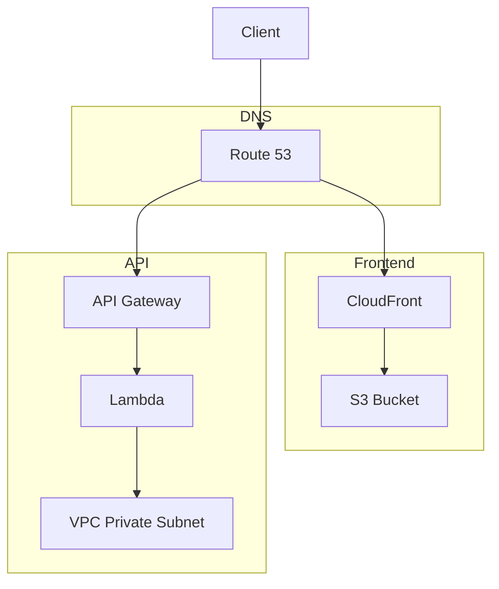

# ⭐ Stardex - Explore GitHub Stars Intelligently

> 🚀 Discover patterns in your GitHub stars through machine learning

[](https://nextjs.org/)
[](https://fastapi.tiangolo.com/)
[](https://scikit-learn.org/)
[](https://www.typescriptlang.org/)
[](https://www.python.org/)
[](https://tailwindcss.com)
[](https://github.com/BjornMelin)
[](https://choosealicense.com/licenses/mit/)
[](https://react.dev)

Stardex helps you explore and understand your GitHub starred repositories through advanced machine learning clustering and interactive visualizations.

## 📚 Table of Contents

- [✨ Features](#-features)
- [🛠️ Technology Stack](#️-technology-stack)
- [🔎 Detailed Features](#-detailed-features)
- [🏗️ Architecture](#️-architecture)
- [🚀 Getting Started](#-getting-started)
- [🔌 API Reference](#-api-reference)
- [🧪 Development](#-development)
- [📈 Performance](#-performance)
- [👨‍💻 Author](#-author)
- [📚 How to Cite](#-how-to-cite)
- [📝 License](#-license)

## ✨ Features

- 🔍 **Smart Analysis**: Machine learning-based clustering of repositories
- 📊 **Interactive Visualization**: Dynamic D3.js visualization of repository clusters
- ⚡ **Real-time Processing**: Fast data processing and clustering
- 🔄 **Efficient Data Flow**: Optimized communication between services
- 🛡️ **Type Safety**: Full TypeScript and Python type coverage
- 🎨 **Modern UI**: Clean, responsive interface with Tailwind CSS
- 📱 **Mobile Ready**: Fully responsive design for all devices

## 🛠️ Technology Stack

- **Frontend**

  - Next.js 13 with App Router
  - React 18 with TypeScript
  - TanStack Query for data management
  - D3.js for visualizations
  - Tailwind CSS for styling
  - Shadcn/ui components

- **Backend**
  - FastAPI for REST API
  - scikit-learn for ML operations
  - Poetry for dependency management
  - Pydantic for data validation

## 🔎 Detailed Features

### Search & Filtering

- Real-time repository search
- Language-based filtering
- Star count range filtering
- Topic-based filtering
- Date range filtering

### AI Clustering

- Multi-algorithm clustering approach:
  - K-means for broad repository grouping
  - Hierarchical clustering for detailed relationships
  - PCA + Hierarchical clustering for large datasets
- TF-IDF vectorization for text analysis
- Configurable clustering parameters
- Performance metrics tracking
- Efficient processing of large datasets

### Visualization

- Interactive D3.js force-directed graph
- Cluster-based coloring
- Zoom and pan capabilities
- Repository details on hover
- Smooth animations and transitions

## 🏗️ Architecture

The application is structured as a monorepo with three main components:

### 🎨 Frontend Service (Next.js)

- Located in `/frontend`
- Built with Next.js, React, and TypeScript
- Uses TanStack Query for data fetching
- Implements a responsive UI with Tailwind CSS
- Visualizes repository clusters using D3.js

### ⚙️ Backend Service (FastAPI)

- Located in `/backend`
- Built with FastAPI and Python
- Implements advanced clustering using scikit-learn
- Provides RESTful API endpoints
- Efficient data processing with sparse matrices
- Parallel processing capabilities

### ☁️ Infrastructure (AWS CDK)

- Located in `/infrastructure`
- Cost-optimized AWS architecture (~$2-6/month)
- Automated deployment via GitHub Actions



#### Key Infrastructure Components

- **Compute**: Lambda functions (256MB, 10s timeout)
- **API**: Regional API Gateway with rate limiting
- **Storage**: S3 for static assets
- **CDN**: CloudFront distribution
- **Networking**: VPC with isolated private subnets
- **DNS**: Route53 with SSL certificates
- **Monitoring**: CloudWatch with 3-day retention

#### Security Features

- TLS 1.2 enforcement
- Security headers (HSTS, X-Content-Type-Options)
- CORS configuration
- Rate limiting (1000 req/min)
- VPC isolation
- IAM least privilege access

#### Cost Optimization

- No NAT Gateway (cost saving)
- Optimized Lambda configuration
- Reduced log retention
- CloudFront caching
- Efficient API Gateway settings

## 🚀 Getting Started

### Prerequisites

1. **Required Tools:**

   ```bash
   node -v  # v20.x
   python -v # v3.11
   aws --version  # For infrastructure deployment
   ```

2. **AWS Setup:**

   - AWS account with admin access
   - Domain name for deployment
   - Route53 hosted zone configured

3. **GitHub Setup:**
   - Fork the repository
   - Configure repository secrets:
     - `AWS_ROLE_ARN`: IAM role for deployments
   - Enable GitHub Actions

### Development Setup

1. **Clone & Configure:**

   ```bash
   # Clone repository
   git clone https://github.com/BjornMelin/stardex.git
   cd stardex

   # Set up environment variables
   cp .env.example .env.local
   # Edit .env.local with your settings
   ```

2. **Install Dependencies:**

   ```bash
   # Install dependencies
   npm install
   cd frontend && npm install
   cd ../backend && poetry install
   ```

3. **Local Development:**

   ```bash
   # Run all services locally
   npm run dev

   # Or run individually
   npm run dev:frontend  # http://localhost:3000
   npm run dev:backend   # http://localhost:8000
   ```

### Production Deployment

1. **Infrastructure:**

   ```bash
   cd infrastructure
   npm install
   npm run deploy:dns        # Set up DNS and SSL
   npm run deploy:storage    # Configure S3 and CloudFront
   npm run deploy:backend    # Deploy API and Lambda
   npm run deploy:monitoring # Set up monitoring
   ```

2. **Application Deployment:**

   - Push changes to main branch
   - GitHub Actions will automatically:
     - Run tests
     - Deploy infrastructure changes
     - Build and deploy frontend
     - Deploy backend
     - Validate deployment

3. **Environment Variables:**

   ```bash
   # Frontend (.env.local)
   NEXT_PUBLIC_API_URL=http://localhost:8000  # Local development
   # NEXT_PUBLIC_API_URL=https://api.your-domain.com  # Production

   # Infrastructure (.env)
   AWS_REGION=us-east-1
   DOMAIN_NAME=your-domain.com
   ENVIRONMENT=production
   ```

4. **Post-Deployment:**
   - Verify DNS propagation
   - Test API endpoints
   - Monitor CloudWatch logs
   - Check CloudFront distribution

## 🚀 Getting Started

1. **Clone & Install:**

   ```bash
   # Install root dependencies
   npm install

   # Install frontend dependencies
   cd frontend
   npm install

   # Install backend dependencies
   cd ../backend
   poetry install
   ```

2. **Environment Setup:**

   ```bash
   # Frontend (.env.local)
   NEXT_PUBLIC_API_URL=http://localhost:8000
   ```

3. **Development:**

   ```bash
   # Run both services
   npm run dev

   # Or run individually
   npm run dev:frontend
   npm run dev:backend
   ```

## 🔌 API Reference

### 🔄 POST /api/cluster

Clusters GitHub repositories based on their features.

<details>
<summary>Request Body</summary>

```json
{
  "repositories": [
    {
      "id": number,
      "name": string,
      "full_name": string,
      "description": string | null,
      "html_url": string,
      "stargazers_count": number,
      "forks_count": number,
      "open_issues_count": number,
      "size": number,
      "watchers_count": number,
      "language": string | null,
      "topics": string[],
      "owner": {
        "login": string,
        "avatar_url": string
      },
      "updated_at": string
    }
  ]
}
```

</details>

<details>
<summary>Response</summary>

```json
[
  {
    "repo": {
      // Repository data (same as input)
    },
    "cluster_id": number,
    "coordinates": [number, number]
  }
]
```

</details>

### 🏥 GET /health

Health check endpoint.

```json
{
  "status": "healthy"
}
```

## 🧪 Development

### 🔬 Technical Implementation

The clustering process follows these steps:

1. 📊 **Feature Extraction**

   - TF-IDF vectorization for text data
   - Repository metadata processing
   - Language and topic encoding

2. 📉 **Dimensionality Reduction**

   - PCA for high-dimensional data
   - Configurable number of components
   - Efficient sparse matrix operations

3. 🎯 **Clustering**

   - K-means for initial grouping
   - Hierarchical clustering with Ward linkage
   - PCA-enhanced hierarchical clustering for large datasets

4. 🎨 **Visualization**
   - Interactive D3.js rendering
   - Cluster-based coloring
   - Smooth animations

### 🛠️ Code Quality

- 📝 **Style Guides**

  - Frontend: ESLint + Prettier
  - Backend: Black + isort

- ✅ **Testing**

  - Frontend: Jest + React Testing Library
  - Backend: pytest

- 🔄 **Git Workflow**
  - Feature branches
  - Pull request reviews
  - Semantic versioning

## 📈 Performance

### ⚡ Backend Optimizations

- Efficient sparse matrix operations
- Parallel processing capabilities
- Memory-optimized data structures
- Request validation & caching

### 🚀 Frontend Optimizations

- Optimized D3.js rendering
- React Query data caching
- Component lazy loading

## 👨‍💻 Author

### Bjorn Melin

- GitHub: [@BjornMelin](https://github.com/BjornMelin)
- Website: [bjornmelin.io](https://bjornmelin.io)
- LinkedIn: [@bjorn-melin](https://www.linkedin.com/in/bjorn-melin/)

## 📚 How to Cite

If you use Stardex in your research or project, please cite it as follows:

```bibtex
@software{melin2024stardex,
  author = {Melin, Bjorn},
  title = {Stardex: GitHub Stars Explorer},
  year = {2024},
  publisher = {GitHub},
  url = {https://github.com/BjornMelin/stardex},
  version = {1.0.0},
  description = {A machine learning-powered tool for exploring and understanding GitHub starred repositories through clustering and interactive visualizations}
}
```

## 📝 License

This project is licensed under the MIT License - see the [LICENSE](LICENSE) file for details.

---

<p align="center">
Built with ❤️ by [Bjorn Melin](https://bjornmelin.io)
</p>
