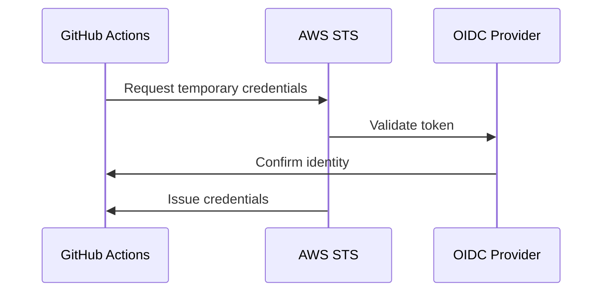
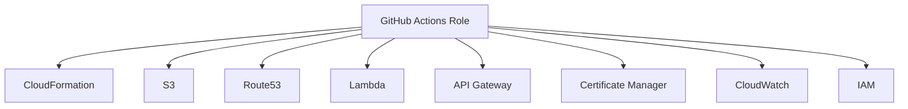
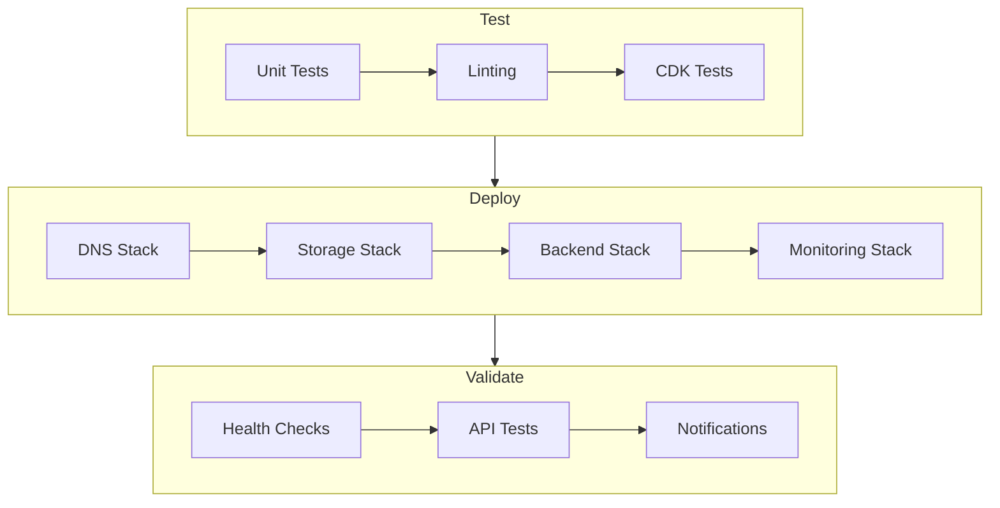
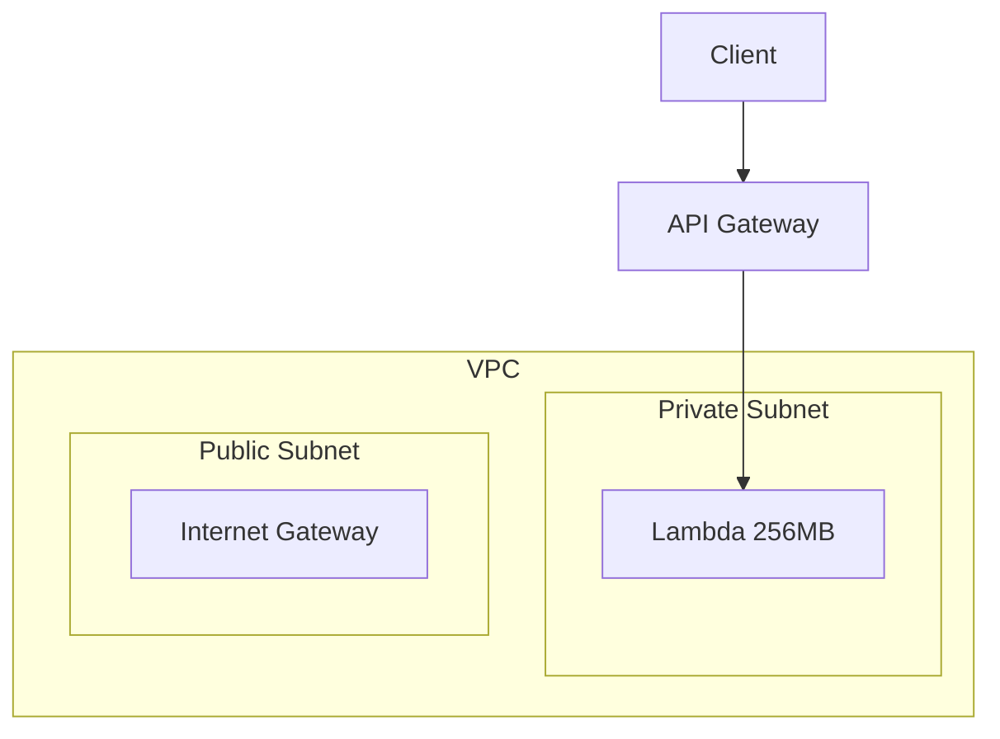
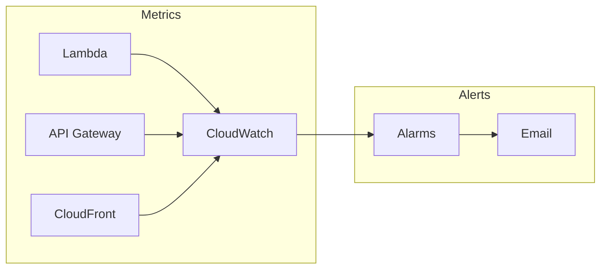
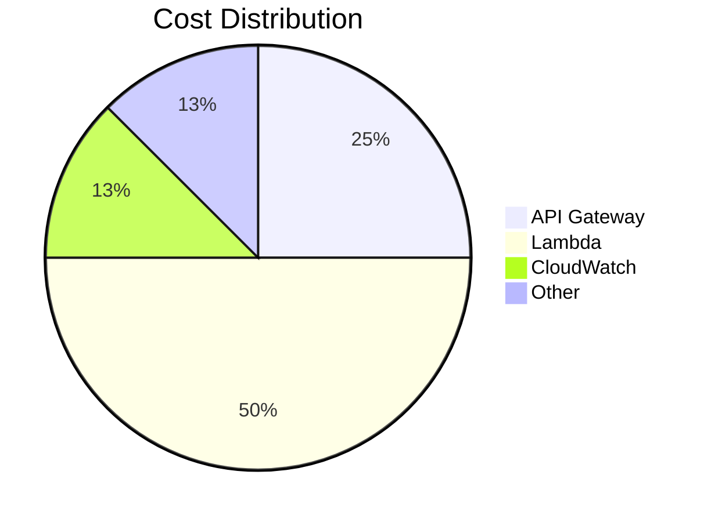

# Stardex Deployment Guide

## Table of Contents 🗂️

- [Prerequisites](#prerequisites)
- [AWS Configuration](#aws-configuration)
- [GitHub Configuration](#github-configuration)
- [Pipeline Stages](#pipeline-stages)
- [Manual Deployment](#manual-deployment)
- [Infrastructure Details](#infrastructure-details)
- [Monitoring and Logs](#monitoring-and-logs)
- [Security Configuration](#security-configuration)
- [Cost Management](#cost-management)
- [Troubleshooting](#troubleshooting)
- [Rollback Procedures](#rollback-procedures)
- [Maintenance](#maintenance)

## Prerequisites

1. **AWS Account Setup**

   - AWS Account with administrator access
   - Route53 hosted zone for bjornmelin.io domain

2. **GitHub Repository Settings**

   - Create a "production" environment
   - Configure environment protection rules
   - Set up required secrets

3. **Local Development Tools**
   ```bash
   # Verify installations
   node --version  # Should be 20.x
   aws --version   # AWS CLI v2
   gh --version    # GitHub CLI
   ```

## AWS Configuration

### 1. OIDC Provider Setup



1. Create OIDC Provider:

```bash
# Provider URL
https://token.actions.githubusercontent.com
```

2. Configure Trust Relationship:

```json
{
  "Version": "2012-10-17",
  "Statement": [
    {
      "Effect": "Allow",
      "Principal": {
        "Federated": "arn:aws:iam::<AWS-ACCOUNT-ID>:oidc-provider/token.actions.githubusercontent.com"
      },
      "Action": "sts:AssumeRoleWithWebIdentity",
      "Condition": {
        "StringLike": {
          "token.actions.githubusercontent.com:sub": "repo:BjornMelin/stardex:*"
        },
        "StringEquals": {
          "token.actions.githubusercontent.com:aud": "sts.amazonaws.com"
        }
      }
    }
  ]
}
```

### 2. Required IAM Permissions



Required permissions:

- CloudFormation full access
- S3 full access
- Route53 full access
- Lambda full access
- API Gateway full access
- Certificate Manager full access
- CloudWatch full access
- IAM role and policy management

## GitHub Configuration

1. Environment Setup:

```bash
# Create production environment
gh environment create production
```

2. Required Secrets:

```bash
# Add AWS role ARN
gh secret set AWS_ROLE_ARN --env production --body "arn:aws:iam::<AWS-ACCOUNT-ID>:role/GithubActionsRole"
```

3. Branch Protection:
   - Require pull request reviews
   - Require status checks
   - Include administrators

## Pipeline Stages



## Infrastructure Details

### Network Architecture



Cost-Optimized Configuration:

- No NAT Gateway (cost saving)
- Isolated private subnet
- Optimized Lambda settings
  - Memory: 256MB
  - Timeout: 10 seconds
- 3-day log retention
- Rate limiting: 1000 req/min

### Security Measures

- TLS 1.2 enforcement
- Security headers:
  - Strict-Transport-Security
  - X-Content-Type-Options
  - X-Frame-Options
- CORS configuration
- VPC isolation
- API rate limiting

## Manual Deployment

```bash
# Initial deployment
cd infrastructure
npm install
npm run deploy:dns
npm run deploy:storage
npm run deploy:backend
npm run deploy:deployment
npm run deploy:monitoring

# Frontend deployment
cd ../frontend
npm install
npm run build
aws s3 sync out/ s3://<BUCKET_NAME>/

# Invalidate CloudFront
aws cloudfront create-invalidation --distribution-id <DISTRIBUTION_ID> --paths "/*"
```

## Monitoring and Logs

### 1. CloudWatch Dashboard



Monitored Metrics:

- API Gateway:
  - Request count
  - Latency
  - Error rates
- Lambda:
  - Invocations
  - Duration
  - Error rate
  - Memory usage
- CloudFront:
  - Request count
  - Cache hit ratio
  - Error rates

### 2. Log Access

- CloudWatch Log Groups (3-day retention)
- API Gateway access logs
- Lambda function logs
- CloudFront logs in S3

## Cost Management

Estimated Monthly Costs: $2-6/month



Cost Optimization Measures:

1. Removed NAT Gateway (~$32/month savings)
2. Optimized Lambda configuration
3. Reduced log retention
4. Using isolated subnet
5. Removed WAF (~$5/month savings)

## Troubleshooting

### 1. Certificate Issues

```bash
# Check certificate status
aws acm describe-certificate --certificate-arn <CERT_ARN>

# Verify DNS records
aws route53 list-resource-record-sets --hosted-zone-id <ZONE_ID>
```

### 2. CloudFront Issues

```bash
# Check distribution status
aws cloudfront get-distribution --id <DIST_ID>

# Invalidate cache
aws cloudfront create-invalidation --distribution-id <DIST_ID> --paths "/*"
```

### 3. API Gateway

```bash
# Test endpoint
curl -v https://api.<your-domain>/health

# Check logs
aws logs tail /aws/api-gateway/<api-name>
```

### 4. Lambda Issues

```bash
# View logs
aws logs tail /aws/lambda/<function-name>

# Test function
aws lambda invoke --function-name <function-name> output.json
```

## Rollback Procedures

### 1. Frontend Rollback

```bash
# Revert to previous version
aws s3 cp s3://<BUCKET_NAME>/<VERSION> s3://<BUCKET_NAME> --recursive

# Invalidate cache
aws cloudfront create-invalidation --distribution-id <DIST_ID> --paths "/*"
```

### 2. Infrastructure Rollback

```bash
# Destroy specific stack
npm run cdk destroy prod-stardex-<stack-name>

# Full rollback
npm run destroy:all
```

## Maintenance

### Regular Tasks

1. **Weekly**

   - Review CloudWatch metrics
   - Check error rates
   - Verify API performance

2. **Monthly**

   - Review cost allocation
   - Update dependencies
   - Security patches

3. **Quarterly**
   - SSL certificate review
   - Performance optimization
   - Architecture review
   - Cost optimization review

### Best Practices

1. **Deployment**

   - Use pull requests
   - Run full test suite
   - Deploy during low-traffic periods
   - Always have rollback plan

2. **Monitoring**

   - Set up alerts for:
     - Error rate spikes
     - Unusual traffic patterns
     - Cost anomalies
     - Performance degradation

3. **Security**
   - Regular security audits
   - Update dependencies
   - Review IAM permissions
   - Monitor security groups
