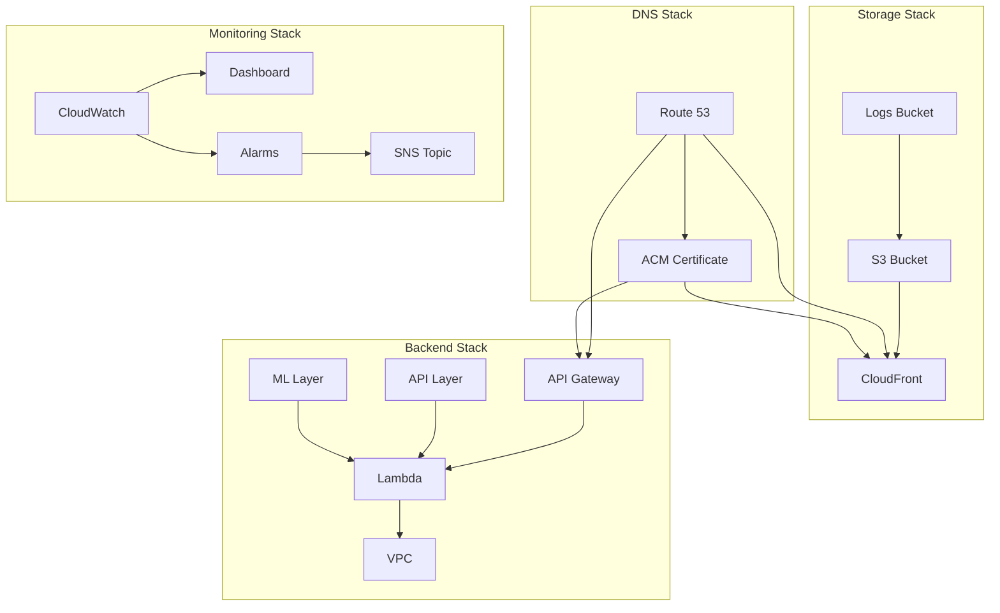

# 🏗️ Stardex Infrastructure

> Infrastructure as Code (IaC) implementation for Stardex using AWS CDK

## 📑 Table of Contents

- [Overview](#-overview)
- [Architecture](#-architecture)
- [Stack Structure](#-stack-structure)
- [Prerequisites](#-prerequisites)
- [Local Development](#-local-development)
- [CI/CD](#-cicd)
- [Directory Structure](#-directory-structure)

## 🎯 Overview

This infrastructure code defines the complete AWS architecture for Stardex using AWS CDK. It implements a secure, scalable, and maintainable infrastructure following AWS best practices.

## 🏛️ Architecture



## 📚 Stack Structure

1. **Bootstrap Stack (`bootstrap-stack.ts`)**

   - Sets up GitHub Actions OIDC authentication
   - Creates necessary IAM roles and policies
   - One-time setup required before other stacks

2. **DNS Stack (`dns-stack.ts`)**

   - Manages Route 53 hosted zones
   - Handles SSL certificate provisioning
   - Sets up domain validation

3. **Parent Stack (`parent-stack.ts`)**

   - Main orchestrator stack
   - Contains nested stacks for modular deployment
   - Manages cross-stack references

4. **Lambda Layer Stack (`lambda-layer-stack.ts`)**
   - Manages Python dependencies
   - Split into API and ML layers
   - Version controlled and retained

## 🛠️ Prerequisites

- Node.js ≥ 18
- AWS CDK CLI
- AWS credentials configured
- Python 3.11 (for Lambda layers)
- Domain name registered in Route 53

## 💻 Local Development

1. **Install Dependencies**

```bash
npm ci                 # Install CDK dependencies
```

2. **Bootstrap CDK (First time only)**

```bash
npm run bootstrap
```

3. **Deploy Stacks**

```bash
# Deploy in order
npm run deploy:dns     # DNS stack first
npm run layer:update   # Lambda layers
npm run deploy:stardex # Main application
npm run deploy:all     # Deploy all stacks
```

4. **Lambda Layer Management**

```bash
# Create and update layers
npm run layer:create   # Create layer directories
npm run layer:install  # Install dependencies
npm run layer:deploy   # Deploy to AWS
npm run layer:clean   # Clean up directories
```

## 🚀 CI/CD

GitHub Actions automatically:

1. Authenticates with AWS using OIDC
2. Updates Lambda layers when dependencies change
3. Deploys infrastructure changes
4. Manages frontend deployments

## 📂 Directory Structure

```
infrastructure/
├── bin/                # CDK app entry point
├── lib/
│   ├── constructs/    # Reusable AWS constructs
│   ├── stacks/       # Stack definitions
│   └── types/        # TypeScript interfaces
├── scripts/          # Utility scripts
└── cdk.json         # CDK configuration
```

## 🔐 Security

- HTTPS everywhere
- VPC isolation
- Principle of least privilege
- OIDC authentication
- Secrets management

## 📊 Monitoring

- CloudWatch dashboards
- Automated alarms
- Error tracking
- Performance metrics
- Cost optimization

## 🏷️ Tags

All resources are tagged with:

- Environment
- Stack
- Service
- ManagedBy: "CDK"

## 📝 License

MIT
