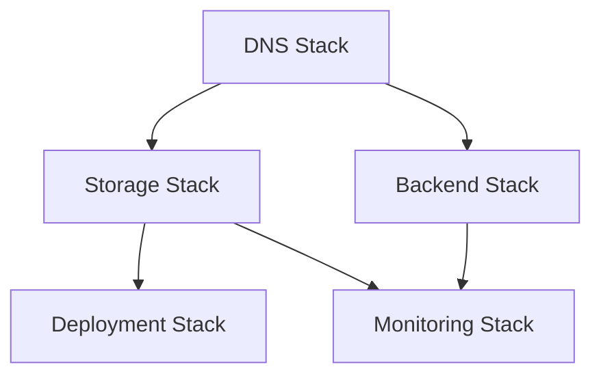

# Stardex Infrastructure

CDK-based infrastructure for the Stardex application.

## Architecture

The infrastructure is organized into reusable constructs and focused stacks:

### Reusable Constructs

- `StaticWebsite`: S3 + CloudFront for frontend hosting
- `ApiEndpoint`: API Gateway with custom domain
- `LambdaFunction`: Standardized Lambda configuration
- `MonitoringDashboard`: CloudWatch metrics and alarms

### Stacks

1. DNS Stack (`prod-stardex-dns`)

   - SSL Certificate
   - Route53 configuration

2. Storage Stack (`prod-stardex-storage`)

   - Frontend hosting
   - CloudFront distribution
   - S3 bucket with versioning

3. Backend Stack (`prod-stardex-backend`)

   - FastAPI Lambda function
   - API Gateway
   - Custom domain (api.stardex.bjornmelin.io)

4. Deployment Stack (`prod-stardex-deployment`)

   - GitHub Actions OIDC auth
   - Deployment permissions

5. Monitoring Stack (`prod-stardex-monitoring`)
   - CloudWatch dashboard
   - Alarms and notifications

## Prerequisites

- Node.js 20.x
- AWS CLI configured
- AWS CDK CLI installed (`npm install -g aws-cdk`)

## Development Setup

1. Install dependencies:

```bash
npm install
```

2. Build TypeScript:

```bash
npm run build
```

3. Bootstrap CDK (first time only):

```bash
cdk bootstrap aws://ACCOUNT-NUMBER/us-east-1
```

## Deployment

Deploy stacks in sequence:

```bash
# Deploy DNS and wait for certificate validation (15-30 mins)
npm run deploy:dns

# Deploy remaining stacks
npm run deploy:storage
npm run deploy:backend
npm run deploy:deployment
npm run deploy:monitoring

# Or deploy all at once (not recommended for first deployment)
npm run deploy:all
```

## Stack Dependencies



## Directory Structure

```
infrastructure/
├── bin/
│   └── app.ts              # CDK app entry point
├── lib/
│   ├── constructs/         # Reusable constructs
│   │   ├── api-endpoint.ts
│   │   ├── lambda-function.ts
│   │   ├── monitoring-dashboard.ts
│   │   └── static-website.ts
│   ├── stacks/            # Stack implementations
│   │   ├── backend-stack.ts
│   │   ├── deployment-stack.ts
│   │   ├── dns-stack.ts
│   │   ├── monitoring-stack.ts
│   │   └── storage-stack.ts
│   ├── types/            # TypeScript types
│   │   └── stack-props.ts
│   └── constants.ts      # Shared constants
├── scripts/             # Helper scripts
│   └── bundle-lambda.sh # Lambda bundling script
├── cdk.json            # CDK configuration
└── package.json        # Dependencies
```

## Available Commands

```bash
# Build TypeScript
npm run build

# Watch for changes
npm run watch

# Compare changes
npm run diff

# Deploy individual stacks
npm run deploy:dns
npm run deploy:storage
npm run deploy:backend
npm run deploy:deployment
npm run deploy:monitoring

# Deploy all stacks
npm run deploy:all

# Destroy all stacks (use with caution)
npm run destroy:all
```

## Monitoring

All resources are monitored through a unified CloudWatch dashboard:

- Frontend: CloudFront metrics, S3 access
- Backend: Lambda metrics, API Gateway metrics
- Custom alarms with email notifications
- Log retention policies

## Security

- HTTPS only
- TLS 1.2+
- Strict security headers
- S3 bucket policies
- IAM least privilege
- CORS configuration
- API Gateway authorization

## Maintenance

To update dependencies:

```bash
npm update
```

To check for security vulnerabilities:

```bash
npm audit
```

## Clean Up

To remove all resources:

```bash
npm run destroy:all
```

Note: Some resources like S3 buckets with versioning enabled will need manual cleanup.
