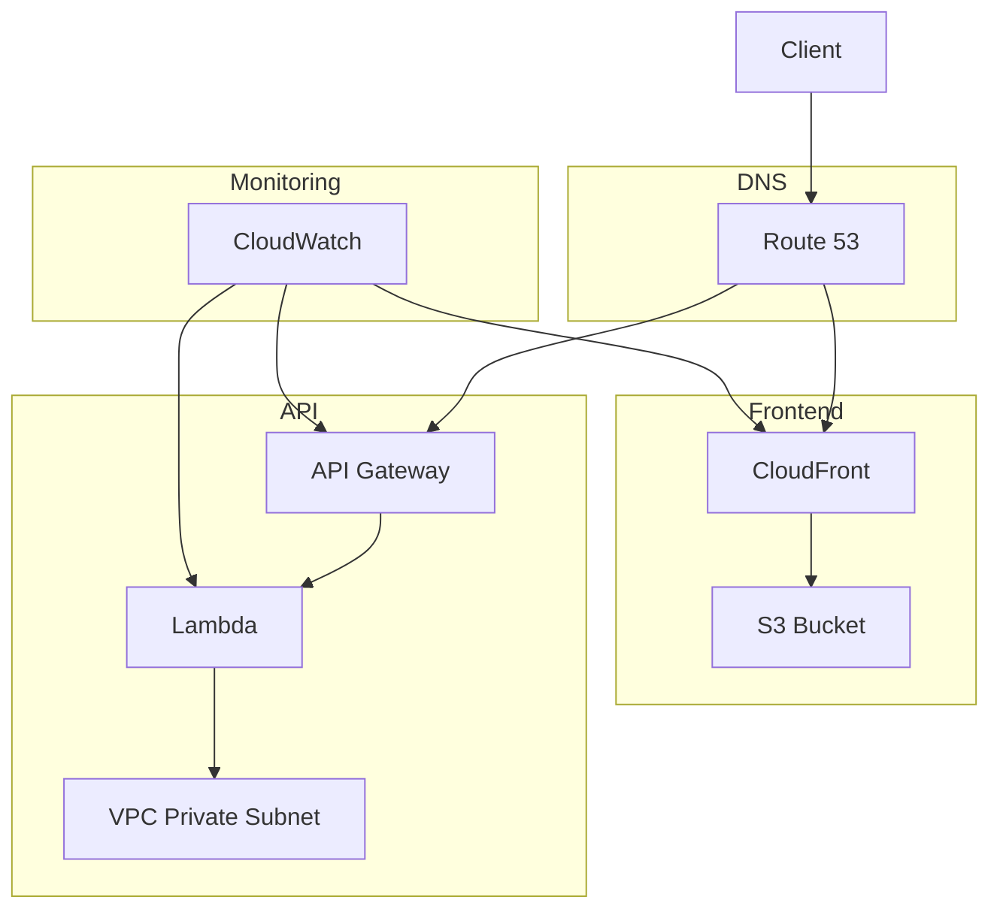
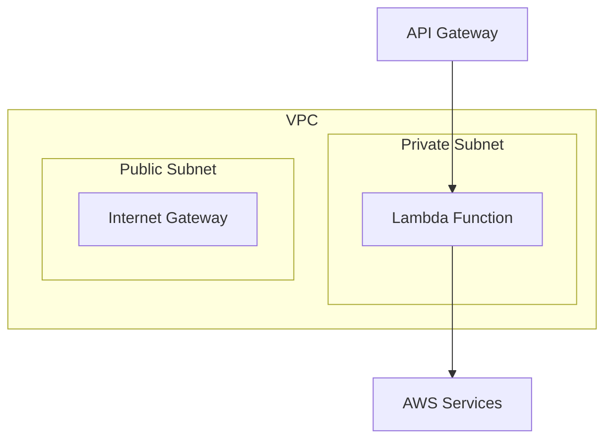
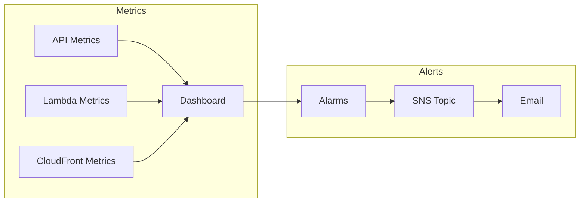

# Stardex Infrastructure

CDK-based infrastructure for the Stardex application with automated setup and deployment.

## Table of Contents 🗂️

- [Quick Start](#quick-start)
- [Architecture Overview](#architecture-overview)
  - [Component Diagram](#component-diagram)
  - [Network Architecture](#network-architecture)
  - [Stack Details](#stack-details)
  - [Reusable Constructs](#reusable-constructs)
- [Development](#development)
- [Deployment](#deployment)
- [Monitoring](#monitoring)
- [Security](#security)
- [Cost Optimization](#cost-optimization)
- [Maintenance](#maintenance)
- [Contributing](#contributing)
- [Additional Documentation](#additional-documentation)

## Quick Start

```bash
# Install dependencies
cd infrastructure
npm install

# Run bootstrap script (requires AWS and GitHub CLI)
chmod +x scripts/bootstrap.sh
./scripts/bootstrap.sh
```

The bootstrap script will:

1. Check prerequisites (AWS CLI, Node.js, GitHub CLI)
2. Install dependencies
3. Bootstrap CDK
4. Deploy the bootstrap stack (OIDC provider and IAM roles)
5. Configure GitHub environment and secrets
6. Create initial infrastructure commit

## Architecture Overview

### Component Diagram



### Network Architecture



### Stack Details

1. **Bootstrap Stack** (`prod-stardex-bootstrap`)

   - GitHub OIDC provider
   - IAM roles for deployment
   - Automated setup

2. **DNS Stack** (`prod-stardex-dns`)

   - SSL Certificate
   - Route53 configuration

3. **Storage Stack** (`prod-stardex-storage`)

   - S3 bucket for frontend
   - CloudFront distribution
   - Security configuration

4. **Backend Stack** (`prod-stardex-backend`)

   - FastAPI Lambda function (256MB memory, 10s timeout)
   - API Gateway with rate limiting
   - Custom domain
   - VPC with isolated private subnet (cost-optimized)

5. **Deployment Stack** (`prod-stardex-deployment`)

   - GitHub Actions permissions
   - Deployment configuration

6. **Monitoring Stack** (`prod-stardex-monitoring`)
   - CloudWatch dashboard
   - Custom metrics
   - Alarms
   - 3-day log retention (cost-optimized)

### Reusable Constructs

- `StaticWebsite`: S3 + CloudFront configuration
- `ApiEndpoint`: API Gateway setup with security headers
- `LambdaFunction`: Optimized Lambda configuration
- `MonitoringDashboard`: Metrics and alarms

## Development

### Prerequisites

- Node.js 20.x
- AWS CLI configured with admin access
- GitHub CLI authenticated
- CDK CLI: `npm install -g aws-cdk`

### Local Development

```bash
# Install dependencies
npm install

# Watch for changes
npm run watch

# Run tests
npm test

# Compare changes
npm run diff
```

### Project Structure

```
infrastructure/
├── bin/
│   └── app.ts              # CDK app entry point
├── lib/
│   ├── constructs/         # Reusable constructs
│   │   ├── api-endpoint.ts
│   │   ├── lambda-function.ts
│   │   ├── monitoring-dashboard.ts
│   │   └── static-website.ts
│   ├── stacks/            # Stack implementations
│   │   ├── bootstrap-stack.ts
│   │   ├── backend-stack.ts
│   │   ├── deployment-stack.ts
│   │   ├── dns-stack.ts
│   │   ├── monitoring-stack.ts
│   │   └── storage-stack.ts
│   ├── types/            # TypeScript types
│   │   └── stack-props.ts
│   └── constants.ts      # Shared configuration
├── scripts/             # Helper scripts
│   ├── bootstrap.sh     # Initial setup
│   └── bundle-lambda.sh # Lambda packaging
└── cdk.json            # CDK configuration
```

## Deployment

### Initial Setup

```bash
# Run automated bootstrap
./scripts/bootstrap.sh

# Or manual steps:
npm install
npx cdk bootstrap
npx cdk deploy prod-stardex-bootstrap
```

### Regular Deployments

Deployments are automated via GitHub Actions:

1. Push changes to a feature branch
2. Create a pull request
3. GitHub Actions runs tests
4. On merge to main:
   - Infrastructure is deployed
   - Application is built and deployed
   - Health checks run
   - Results posted to PR

Manual deployment if needed:

```bash
npm run deploy:dns
npm run deploy:storage
npm run deploy:backend
npm run deploy:deployment
npm run deploy:monitoring
```

## Monitoring



- CloudWatch dashboard with key metrics
- 3-day log retention
- Automated alerts
- Performance tracking
- API Gateway metrics
- Lambda performance metrics

## Security

- Security headers (HSTS, X-Content-Type-Options, X-Frame-Options)
- OIDC authentication
- Least privilege permissions
- Resource encryption
- CORS configuration
- Rate limiting (1000 req/min)
- VPC isolation
- TLS 1.2 enforcement

## Cost Optimization

Estimated monthly cost: $2-6/month

Cost-saving measures:

- Removed NAT Gateway (~$32/month savings)
- Optimized Lambda configuration (256MB, 10s timeout)
- Reduced log retention to 3 days
- Using isolated private subnet
- Removed WAF (trading off advanced protection for ~$5/month savings)

## Maintenance

### Common Tasks

```bash
# Update dependencies
npm update

# Run security audit
npm audit

# Check for CDK updates
npm outdated

# Destroy resources
npm run destroy:all
```

### Troubleshooting

See `DEPLOYMENT.md` for:

- Detailed troubleshooting steps
- Common issues and solutions
- Rollback procedures
- Security considerations

## Contributing

1. Create feature branch
2. Make changes
3. Run tests: `npm test`
4. Create pull request
5. Wait for CI checks
6. Get approval
7. Merge to main

## Additional Documentation

- [Deployment Guide](./DEPLOYMENT.md)
- [AWS CDK Documentation](https://docs.aws.amazon.com/cdk/latest/guide/)
- [GitHub Actions Documentation](https://docs.github.com/en/actions)
