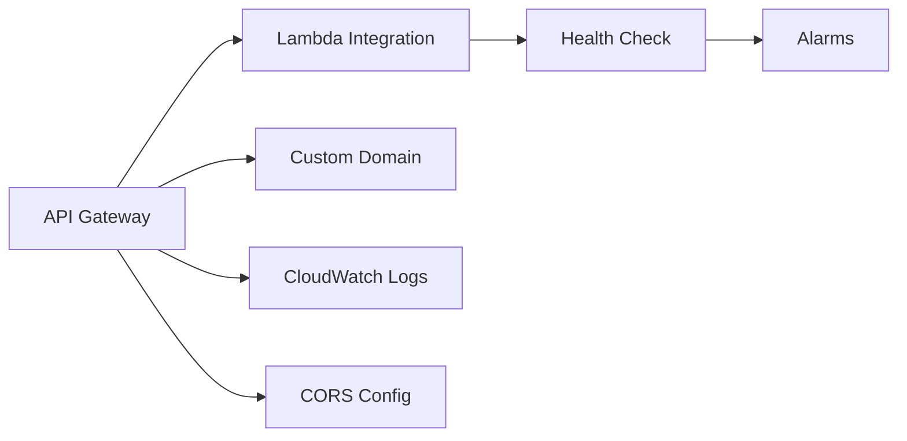
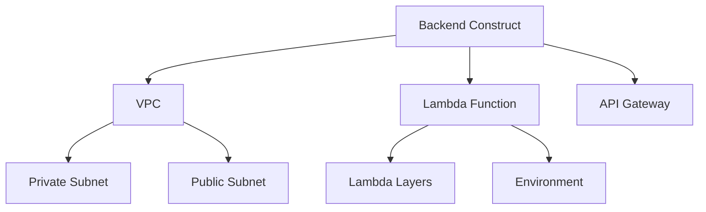
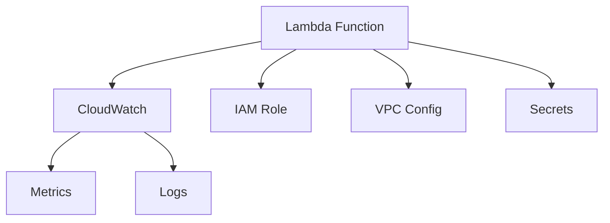
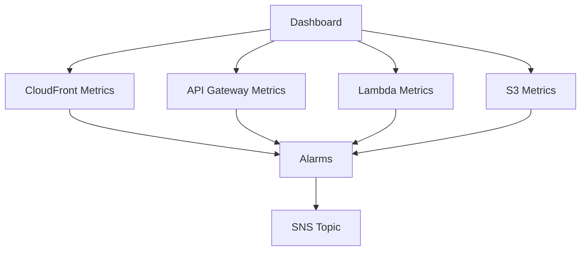
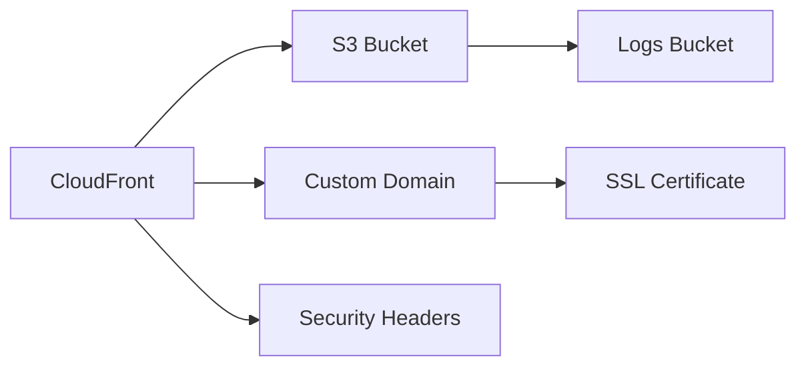

# 🏗️ AWS CDK Constructs

> Reusable CDK constructs for Stardex infrastructure components

## 📑 Table of Contents

- [Overview](#-overview)
- [Constructs](#-constructs)
- [Best Practices](#-best-practices)

## 🎯 Overview

This directory contains reusable AWS CDK constructs that define core infrastructure components. Each construct is designed to be modular, configurable, and follows AWS best practices.

## 🔧 Constructs

### 🌐 ApiEndpoint (`api-endpoint.ts`)

Creates an API Gateway endpoint with:



Key features:

- Custom domain support
- CORS configuration
- Access logging
- Health check endpoint
- CloudWatch alarms
- Security headers

### 🔙 BackendConstruct (`backend-construct.ts`)

Main backend infrastructure:



Features:

- VPC isolation
- Cost-optimized networking
- Lambda integration
- Layer support

### λ LambdaFunction (`lambda-function.ts`)

Reusable Lambda function configuration:



Capabilities:

- Consistent configuration
- Metrics setup
- VPC support
- Secrets integration
- Cost optimization

### 📊 MonitoringConstruct (`monitoring-construct.ts`)

Centralized monitoring setup:

- Integrates with MonitoringDashboard
- Manages SNS topics
- Configures alerts

### 📈 MonitoringDashboard (`monitoring-dashboard.ts`)

Comprehensive monitoring:



Features:

- Performance metrics
- Error tracking
- Cost analysis
- Email notifications

### 🌍 StaticWebsite (`static-website.ts`)

Static website hosting infrastructure:



Features:

- CloudFront distribution
- S3 optimization
- Log management
- Security headers
- SSL support

### 📦 StorageConstruct (`storage-construct.ts`)

Storage management:

- S3 bucket creation
- CloudFront integration
- Access controls

## 💡 Best Practices

1. **Reusability**

   - Use interfaces for props
   - Keep constructs modular
   - Follow single responsibility

2. **Security**

   - Enable encryption
   - Use VPC isolation
   - Implement least privilege
   - Add security headers

3. **Monitoring**

   - Include CloudWatch metrics
   - Set up meaningful alarms
   - Configure log retention

4. **Cost Optimization**

   - Use cost-effective services
   - Implement lifecycle policies
   - Configure auto-scaling

5. **Maintenance**

   - Add descriptive tags
   - Document configurations
   - Use consistent naming

6. **Performance**
   - Enable caching
   - Optimize assets
   - Use regional endpoints

## 🔍 Usage

```typescript
// Example: Creating an API endpoint
const api = new ApiEndpoint(this, "API", {
  domainName: "api.example.com",
  environment: "prod",
  certificate: certificate,
  hostedZone: hostedZone,
  lambdaFunction: myFunction,
  apiName: "MyAPI",
  allowOrigins: ["https://example.com"],
});
```

## 📝 Contributing

When adding new constructs:

1. Follow naming conventions
2. Add proper documentation
3. Include type definitions
4. Implement monitoring
5. Add security controls
6. Write clear interfaces
