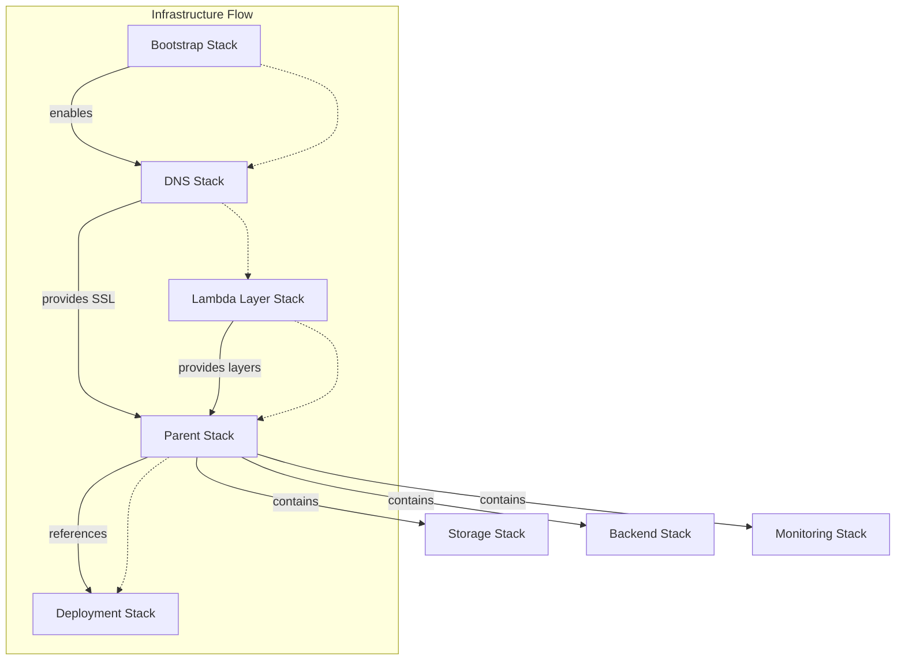
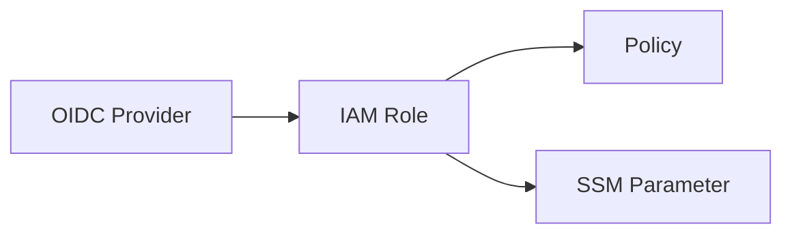
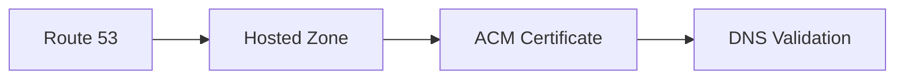
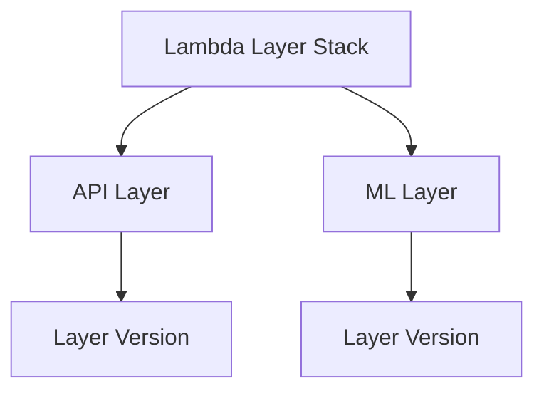
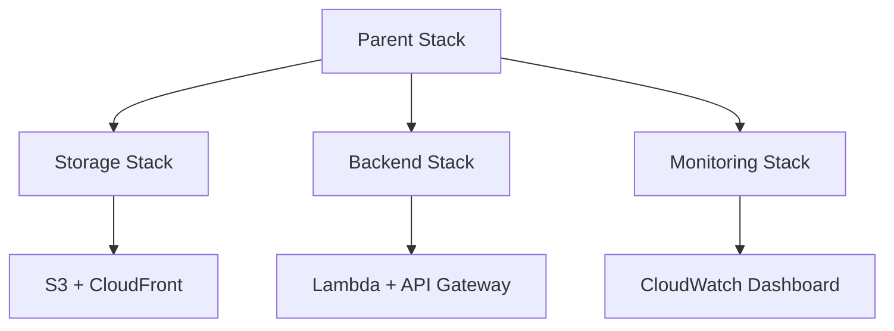

# 🏗️ CDK Stacks

> Core infrastructure stacks for Stardex application

## 📑 Table of Contents

- [Overview](#-overview)
- [Stack Architecture](#-stack-architecture)
- [Stack Details](#-stack-details)
- [Deployment Flow](#-deployment-flow)

## 🎯 Overview

This directory contains the AWS CDK stack definitions that form the core infrastructure of Stardex. The stacks are designed to be modular, maintainable, and follow a clear dependency hierarchy.

## 🏛️ Stack Architecture



## 📚 Stack Details

### 🔐 Bootstrap Stack (`bootstrap-stack.ts`)

Sets up initial AWS infrastructure:

- GitHub Actions OIDC provider
- IAM roles and policies
- SSM parameters



### 🌐 DNS Stack (`dns-stack.ts`)

Manages DNS and certificates:

- Route 53 hosted zones
- ACM certificates
- DNS validation



### 🎯 Lambda Layer Stack (`lambda-layer-stack.ts`)

Manages Python dependencies:

- API dependencies layer
- ML dependencies layer
- Version control
- Layer permissions



### 👨‍👩‍👧‍👦 Parent Stack (`parent-stack.ts`)

Main orchestrator stack:

- Contains nested stacks
- Resource sharing
- Cross-stack references



### 🚀 Deployment Stack (`deployment-stack.ts`)

Manages deployment resources:

- IAM permissions
- S3 access
- CloudFront invalidations

## 🔄 Deployment Flow

1. **Bootstrap Phase**

```bash
npm run bootstrap:aws    # AWS CDK bootstrap
npm run bootstrap:stack # OIDC setup
```

2. **Infrastructure Phase**

```bash
npm run deploy:dns     # DNS configuration
npm run layer:update   # Lambda layers
npm run deploy:stardex # Main application
```

3. **Application Phase**

```bash
npm run deploy:deployment # Deployment resources
```

## 🏷️ Stack Properties

All stacks extend base properties:

```typescript
interface BaseStackProps {
  domainName: string; // Application domain
  rootDomainName: string; // Root domain name
  environment: string; // Deployment environment
  tags?: Record<string, string>; // Resource tags
}
```

## 🔑 Best Practices

1. **Stack Organization**

   - Clear dependencies
   - Modular design
   - Cross-stack references

2. **Security**

   - OIDC authentication
   - Least privilege
   - Resource encryption

3. **Naming**

   - Consistent patterns
   - Environment prefixes
   - Clear resource names

4. **Resource Management**
   - Cost optimization
   - Cleanup policies
   - Version control

## 📈 Monitoring and Metrics

Each stack implements:

- CloudWatch metrics
- Custom dashboards
- Automated alarms
- Log retention

## 🔧 Customization

Configure stack behavior through:

1. Environment variables
2. CDK context
3. Stack props
4. AWS tags

## 🚨 Error Handling

- Graceful rollbacks
- Error notifications
- Resource cleanup
- State management

## 📝 Contributing

When adding new stacks:

1. Follow naming convention
2. Update dependency graph
3. Add proper documentation
4. Implement monitoring
5. Consider cost impact
