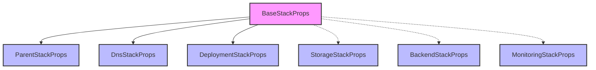

# 📝 Stack Types

> TypeScript type definitions for Stardex infrastructure stacks

## 📑 Table of Contents

- [Overview](#-overview)
- [Type Hierarchy](#-type-hierarchy)
- [Type Details](#-type-details)
- [Usage Examples](#-usage-examples)

## 🎯 Overview

This directory contains TypeScript interfaces and type definitions used across the infrastructure code. These types ensure type safety and provide clear contracts for stack properties.

## 🔄 Type Hierarchy



## 📚 Type Details

### 🔨 Base Stack Props

```typescript
interface BaseStackProps extends cdk.StackProps {
  domainName: string; // Application domain
  rootDomainName: string; // Root domain for DNS
  environment: string; // Deployment environment
  tags?: Record<string, string>; // Resource tags
}
```

### 👨‍👩‍👧‍👦 Parent Stack Props

```typescript
interface ParentStackProps extends BaseStackProps {
  certificate: acm.ICertificate; // SSL certificate
  hostedZone: route53.IHostedZone; // Route53 zone
  apiLayer?: lambda.ILayerVersion; // API dependencies
  mlLayer?: lambda.ILayerVersion; // ML dependencies
}
```

### 🌐 DNS Stack Props

```typescript
interface DnsStackProps extends BaseStackProps {}
```

### 📦 Storage Stack Props

```typescript
interface StorageStackProps {
  domainName: string;
  rootDomainName: string;
  environment: string;
  tags?: Record<string, string>;
  certificate: acm.ICertificate;
  hostedZone: route53.IHostedZone;
}
```

### 🔙 Backend Stack Props

```typescript
interface BackendStackProps {
  domainName: string;
  rootDomainName: string;
  environment: string;
  tags?: Record<string, string>;
  certificate: acm.ICertificate;
  hostedZone: route53.IHostedZone;
  apiLayer?: lambda.ILayerVersion;
  mlLayer?: lambda.ILayerVersion;
}
```

### 🚀 Deployment Stack Props

```typescript
interface DeploymentStackProps extends BaseStackProps {
  bucket: s3.IBucket;
  distribution: cloudfront.IDistribution;
}
```

### 📊 Monitoring Stack Props

```typescript
interface MonitoringStackProps {
  domainName: string;
  rootDomainName: string;
  environment: string;
  tags?: Record<string, string>;
  bucket: s3.IBucket;
  distribution: cloudfront.IDistribution;
  lambda?: lambda.IFunction;
  api?: apigateway.RestApi;
}
```

## 💡 Usage Examples

### Creating a Stack

```typescript
class MyStack extends cdk.Stack {
  constructor(scope: Construct, id: string, props: ParentStackProps) {
    super(scope, id, props);
    // Stack implementation
  }
}
```

### Type Guards

```typescript
function hasLambdaLayer(
  props: BackendStackProps
): props is BackendStackProps & { apiLayer: lambda.ILayerVersion } {
  return props.apiLayer !== undefined;
}
```

## 🔑 Best Practices

1. **Type Safety**

   - Use strict TypeScript settings
   - Avoid `any` types
   - Implement proper interfaces

2. **Documentation**

   - Document all interfaces
   - Include property descriptions
   - Add usage examples

3. **Naming Conventions**

   - Consistent naming
   - Clear property names
   - Descriptive interfaces

4. **Code Organization**
   - Group related types
   - Use logical file structure
   - Maintain clear hierarchy

## 🚨 Common Gotchas

1. **Optional Properties**

   - Handle undefined values
   - Provide defaults
   - Use type guards

2. **Resource References**

   - Check for existence
   - Handle cross-stack refs
   - Validate properties

3. **Type Extensions**
   - Consider inheritance
   - Check compatibility
   - Maintain contracts

## 📝 Contributing

When adding new types:

1. Follow naming conventions
2. Document all properties
3. Update type hierarchy
4. Add usage examples
5. Consider compatibility
